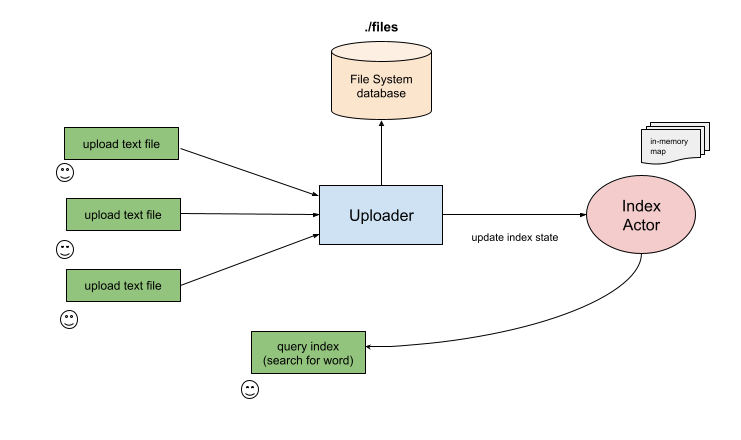

# File Index Library (Kotlin)

## Description
Simple Kotlin library + CLI application for managing database of indexed text files. User can perform simple queries to find in which file the specific word is located (along with precise line/character position within each file).

## Build and Usage
1. `$ cd {project_folder}` - go to main project folder
2. `$ ./gradlew :shadowJar` - build FAT Jar, containing the library along with all dependencies
3. `$ java -jar ./build/libs/library.jar` - run CLI (command-line-interface) 

## CLI
Library exposes simple CLI (command-line-interface) application which can be used to interact with database and perform queries (i.e. search for specific word). Type 'help' inside the CLI session to get the list of available commands. 

## Library Design

There are two main components in the library:

* **Uploader** (manages database of files, tracks changes and synchronizes them with index actor)
* **Index Actor** (manages index state for quick word search)

Uploader component is responsible for managing the database of files. Ordinary filesystem is used as a file storage. Uploader maintains the map of file locks to guard database files against concurrent changes from multiple threads. However, it's OK if each thread accesses separate file (this can be leveraged for parallel uploads). Each file upload + analysis (parsing) task runs on separate I/O dispatcher. User can override this and provide another context instead (i.e. custom thread pool).

Index Actor is responsible for managing index state and perform queries. Incoming requests are processed on-by-one. The current design of the index favors consistency/simplicity (no locks involved) over performance and scalability. 

## Possible Improvements
* In curent design **Index Actor** cannot serve multiple query requests in-parallel. To speed-up the queries, we could run multiple child actors and spread the keys among them. Main actor then acts as a router, redirecting query incoming request to child actor. Keys can be distributed using hash function.
* Currently, indexes are being stored in memory (RAM). This allows for fast retrievals bit if index will not fit the RAM, tha app will crash. Some persistent key/value store solution (something like https://mapdb.org/) have to be used instead.

